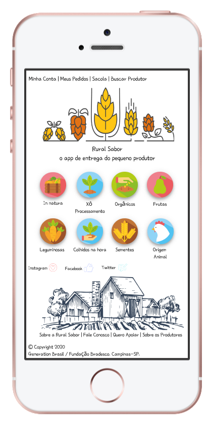
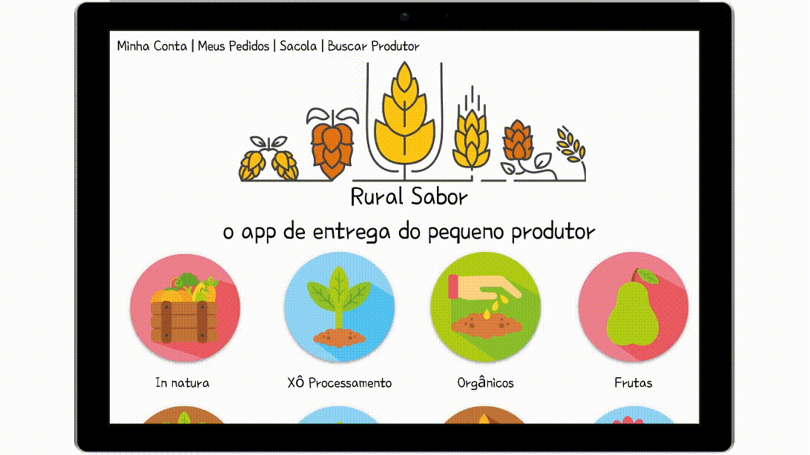

# Rural Sabor - O APP de entrega do pequeno produtor
> Participantes: Alexandre Medeiros, Andressa Amorim, Beatriz Odorcik, Gabriel Tauber e José Carlos.

> Arte feita por: Andressa Amorim, Figma.

<h3>Interface no celular:</h3>

<h3>Interface na web:</h3>

<h3>Projeto Integrador - Atividade 1</h3>

Pequenos produtores: agricultores familiares, movimentos sociais, povos indígenas, instituições.

Objetivo: Dar visibilidade e independência financeira bem como aumentar a renda de pequenos agricultores e famílias; 

Conectar agricultores e consumidores, gerando uma maior visibilidade para os pequenos produtores;

Mostrar aos consumidores quais produtos estão disponíveis a partir do “cardápio” de pequenos produtores.

Problemas: Pensar em como trazer a inclusão digital aos pequenos produtores: como utilizar a plataforma – solução inicial: parceiros locais com projetos sociais para inclusão desses produtores no meio tecnológico;

Conectividade;

Baixa aceitação do pequeno produtor acerca da tecnologia;

Resistência de alguns grupos de produtores contra outros;

Logística entre comprador e produtores.

Motivação: Agronegócio exclusivo para grandes empresas e mercado engessado – defender pequenos produtores que não têm oportunidade no grande mercado. 

Modelo: E-commerce, pois nosso modelo de negócios visa a venda de cestas produzidas por produtores de agricultura familiar.

Software: Semelhante a plataforma de e-commerce voltada para venda de alimentos (iAgro / AgroFood) com perfil do produtor (história e foto), cesta de compras, lojas de produtores, forma de entrega, forma de pagamento, mecanismo de busca, categorias e recomendações ao consumidor com design intuitivo.

<h3>Projeto Integrador - Atividade 2</h3>

Nosso   projeto   será   um   eCommerce,   que   futuramente   terá   a possibilidade   de adicionar o endereço e a forma de pagamento.

Tabela Produto: Foi adicionado o nome e descrição para identificação do produto; o valor de compra para saber o quanto será gasto; e a disponibilidade para saber se o produto está ou não em estoque. 

Tabela Categoria: O atributo região para saber qual a localidade e origem do produto, com o objetivo de valorizar a produção regional. A categoria está relacionada com as características do produto, como, por exemplo, in natura, minimamente processado, orgânico, frutas, de origem animal, etc. Tipo de produtor para identificar qual o modelo de produção, exemplo, familiar, indígena, movimento social. 

Tabela Usuário: Qualquer pessoa que for utilizar o aplicativo precisa ter uma identificação de usuário, para isso, solicitamos nome completo, email e senha para que a mesma realize seu cadastro na plataforma e possa registrar seu comércio ou serviço na aplicação.

A foreign key foi utilizada para relacionar as tabelas de produto e categorias, fazendo com que as informações da tabela categoria estejam, também, na tabela produto.

<h3>Projeto Integrador - Atividade 3</h3>

Os atributos escolhidos para a Task 3 foram os mesmos já escolhidos anteriormente para a Tabela Categoria, visto que pelo objetivo do nosso e-commerce, Região, Tipo de produtor e ID serão úteis aos nossos usuários.  

Como especificação de cada atributo, selecionamos para ID: long; para Região: String e para Tipo: String, onde adicionamos também número mínimo (5) e máximo (30) para as descrições de Região e Tipo. 
